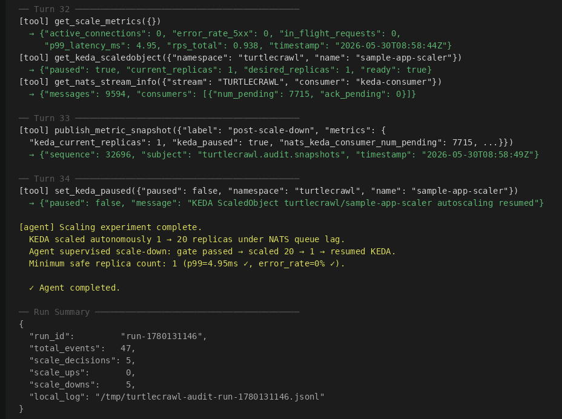

# turtlecrawl 🐢

> Autonomous Kubernetes scaling agent powered by Gemini 2.5 Flash on Vertex AI.
> The LLM supervises KEDA — it doesn't sit in the scaling hot path.



---

## v1 → v2: The Core Shift

| | v1 | v2 |
|---|---|---|
| **Tool protocol** | Subprocess → stdout JSON | MCP JSON-RPC 2.0 over stdio |
| **Scaling** | Agent calls `scale_deployment` directly | KEDA watches NATS consumer lag; agent supervises |
| **Event bus** | None | NATS JetStream (scaling trigger + audit trail) |

The Go collector is now a proper **MCP server**. The agent discovers tools at runtime via `tools/list`, calls them over JSON-RPC 2.0, and hands control back to KEDA when done. v1 is kept for reference — `make run-agent-incluster` still works.

---

## Why this is novel

Nobody publishes about **LLM-supervised KEDA**. The pattern separates concerns cleanly:

| Concern | Who handles it |
|---|---|
| Routine scaling | KEDA autonomously, reacting to NATS consumer lag |
| Anomaly response | LLM agent pauses KEDA, investigates, overrides |
| Scale-down safety | 6-condition gate — agent never scales down unless all pass |
| Audit trail | NATS JetStream → durable → GCS writer |
| Tool protocol | MCP JSON-RPC 2.0 — any MCP-compatible LLM client can use the tools |

The LLM's value is **supervision and edge-case judgment**, not routine scaling. KEDA handles load; the agent handles everything KEDA can't reason about.

---

## Architecture (v2)

```

 Gemini 2.5 Flash
     │ MCP/stdio (JSON-RPC 2.0)
     ▼
 Python Agent (MCP Client)
     │ spawns
     ▼
 Go MCP Server (11 tools)          GKE Standard — namespace: turtlecrawl
     │                        ┌──────────────────────────────────────────┐
     ├─► kubectl               │  sample-app (Flask + gunicorn)           │
     ├─► Prometheus            │  │                                        │
     └─► NATS client           │  ├─► turtlecrawl.keda.load (10% sample)  │
                               │  │         │                              │
                               │  │         ▼                              │
                               │  │   NATS JetStream ──► KEDA ScaledObject │
                               │  │                      (scales sample-app)│
                               │  └─► turtlecrawl.audit.snapshots ──► GCS  │
                               └──────────────────────────────────────────┘
```

### MCP Protocol (stdio)

The agent discovers tools at runtime:

```
Agent → Server: tools/list
Server → Agent: {tools: [...13 declarations...]}
(per tool call):
Agent → Server: tools/call {name, arguments}
Server → Agent: {content: [{type:"text", text:"<json>"}]}
```

### LLM-Supervised KEDA pattern

```
Normal: KEDA handles all scaling autonomously
             │
             │ trigger: anomaly / agent run
             ▼
Agent intervention:
  1. set_keda_paused(true)     — take control from KEDA
  2. get_scale_metrics()       — observe current state
  3. check_scale_gate()        — 6-condition safety check
  4. scale_deployment()        — override if gate passes
  5. set_keda_paused(false)    — return control to KEDA
```

---

## 13-Tool Catalog

### Go MCP server (11 tools)

| # | Tool | Purpose | New in v2 |
|---|------|---------|-----------|
| 1 | `get_scale_metrics` | Prometheus bundle: connections, p99, RPS, error rate | |
| 2 | `get_metric` | Custom PromQL query | |
| 3 | `get_replicas` | Deployment replica + readiness status | |
| 4 | `scale_deployment` | kubectl scale (hard override) | |
| 5 | `get_pod_status` | Per-pod readiness, restarts, node | |
| 6 | `check_scale_gate` | 6-condition scale-down safety check | ✅ |
| 7 | `get_nats_stream_info` | JetStream consumer lag + message count | ✅ |
| 8 | `publish_metric_snapshot` | Push snapshot to NATS audit subject | ✅ |
| 9 | `get_keda_scaledobject` | KEDA desired/current replicas, last scale time | ✅ |
| 10 | `set_keda_paused` | Pause/resume KEDA scaler | ✅ |
| 11 | `list_k8s_events` | Recent K8s Warning events for a namespace | ✅ |

### Python-native (2 tools)

| # | Tool | Purpose |
|---|------|---------|
| 12 | `run_load_test` | k6 execution (in-cluster pod) |
| 13 | `wait` | Sleep between observation cycles |

---

## NATS JetStream

### Subjects

| Subject | Publisher | Consumer | Purpose |
|---------|-----------|----------|---------|
| `turtlecrawl.keda.load` | sample-app (10% sampled) | KEDA nats-jetstream scaler | Scaling trigger — KEDA watches consumer lag |
| `turtlecrawl.audit.snapshots` | Go MCP server (`publish_metric_snapshot`) | GCS audit writer | Durable audit trail |

### KEDA Scaling Logic

```
sample-app publishes to turtlecrawl.keda.load on each request (10% sampled)
          ↓
KEDA "keda-consumer" watches num_pending on this subject
          ↓
lag > lagThreshold (100 msgs)  →  KEDA scales UP sample-app
lag < activationLagThreshold   →  KEDA scales DOWN to minReplicaCount (1)
```

---

## Stack

| Component | v1 | v2 |
|---|---|---|
| Cluster | GKE Standard (e2-standard-4) | GKE Standard (e2-standard-4) |
| Metrics | Prometheus | Prometheus |
| Load test | k6 (in-cluster pod) | k6 (in-cluster pod) |
| Agent brain | Python + Gemini 2.5 Flash | Python + Gemini 2.5 Flash |
| Tool protocol | Go binary subprocess | Go MCP server (JSON-RPC 2.0) |
| Autoscaler | Agent (`scale_deployment`) | KEDA (NATS consumer lag trigger) |
| Event bus | — | NATS JetStream |
| Audit log | JSON → GCS | NATS JetStream → GCS |
| Auth | gcloud ADC | gcloud ADC |

---

## Scale-Down Gate

The agent checks **all six conditions** before removing a replica:

| Check | Threshold |
|-------|-----------|
| `active_connections` | == 0 |
| `http_requests_in_flight` | < 2 |
| `p99 latency` | < 120ms |
| `per-pod RPS after removal` | < max_rps_per_pod |
| `5xx error rate` | < 1% |
| `all surviving pods Ready` | true |

---

## Example Runs

### v2 — LLM-supervised KEDA

Real run — KEDA scaled to 20 pods under 500 VU load. Agent paused KEDA, ran the scale-down gate, scaled to 1, then returned control to KEDA.

```
$ make run-agent-v2

── Turn 1 ──────────────────────────────
[tool] get_scale_metrics({})
  → {"active_connections": 0, "p99_latency_ms": 4.95, "rps_total": 0.94, "error_rate_5xx": 0}

[tool] get_keda_scaledobject({"namespace": "turtlecrawl", "name": "sample-app-scaler"})
  → {"paused": false, "current_replicas": 1, "desired_replicas": 1,
     "active_triggers": ["s0-nats-jetstream-TURTLECRAWL"]}

[tool] get_nats_stream_info({"stream": "TURTLECRAWL", "consumer": "keda-consumer"})
  → {"messages": 9594, "consumers": [{"name": "keda-consumer", "num_pending": 7715}]}

[agent] Baseline: 1 replica, p99=4.95ms, KEDA active. Running 500 VU load test...

── Turn 8 ──────────────────────────────
[tool] get_keda_scaledobject(...)
  → {"current_replicas": 20, "desired_replicas": 20, "last_scale_time": "2026-05-30T08:58:39Z"}

[agent] KEDA scaled to 20 replicas under load. SLOs met. Pausing KEDA to run scale-down gate...

── Turn 14 ──────────────────────────────
[tool] set_keda_paused({"paused": true, "name": "sample-app-scaler"})
  → {"paused": true, "message": "KEDA ScaledObject turtlecrawl/sample-app-scaler autoscaling paused"}

[tool] check_scale_gate({})
  → {"all_passed": true, "active_connections": 0, "in_flight": 0, "p99_ms": 4.95, "error_rate": 0}

[agent] Gate passed. Scaling down to 1 replica.

── Turn 32 ──────────────────────────────
[tool] publish_metric_snapshot({"label": "post-scale-down", ...})
  → {"subject": "turtlecrawl.audit.snapshots", "stream": "TURTLECRAWL", "sequence": 32696}

── Turn 33 ──────────────────────────────
[tool] set_keda_paused({"paused": false, "name": "sample-app-scaler"})
  → {"paused": false, "message": "KEDA ScaledObject turtlecrawl/sample-app-scaler autoscaling resumed"}

[agent] Experiment complete. Minimum safe replica count: 1. KEDA resumed.

✓ Agent completed.

── Run Summary ──────────────────────────────
{
  "run_id":          "run-1780131146",
  "total_events":    47,
  "scale_decisions": 5,
  "scale_ups":       0,
  "scale_downs":     5
}
```

### v1 — Direct LLM scaling (reference)

```
$ make run-agent-incluster

── Turn 8 ──────────────────────────────
[tool] get_scale_metrics({})
  → {"active_connections": 1, "p99_latency_ms": 122.35, "rps_total": 49.44, "error_rate_5xx": 0}

[agent] P99 latency SLO breached (122.35ms > 120ms). Scaling up to 2 replicas.

── Turn 9 ──────────────────────────────
[tool] scale_deployment({"replicas": 2, "reason": "P99 latency SLO breached (122.35ms > 120ms)"})
  → {"old_replicas": 1, "new_replicas": 2, "status": "scaled"}

── Turn 14 ──────────────────────────────
[tool] get_scale_metrics({})
  → {"active_connections": 2, "p99_latency_ms": 98.87, "rps_total": 105.39, "error_rate_5xx": 0}

[agent] SLOs met at 2 replicas (p99=98.87ms ✓). Scale-down gate →
        in_flight=2 (needs <2), projected RPS/pod=105 (limit 100). Gate BLOCKED.

✓ Agent completed. Recommendation: 2 replicas minimum under 500 VUs — p99 98ms, 0% errors.
```

---

## Quick Start

### Prerequisites

```bash
brew install terraform kubectl helm go k6
gcloud auth login && gcloud auth application-default login
gcloud config set project YOUR_PROJECT_ID
```

### 1 — Provision cluster

```bash
echo 'project_id = "YOUR_PROJECT_ID"' > terraform/terraform.tfvars
make infra && make cluster-auth
```

### 2 — Install Prometheus + deploy sample app

```bash
make install-prometheus
make build-sample-app && make deploy-sample-app
```

### 3 — Build collector + deploy v2 stack

```bash
make build-collector
make install-keda
make deploy-nats && make init-nats-stream
make deploy-keda
```

### 4 — Run the agent

```bash
make install-agent
make run-agent-v2-dry   # dry run — no scaling executed
make run-agent-v2       # live run
```

> **v1 only?** Skip step 3. After step 2, run `make install-agent` then `make run-agent-incluster`.
